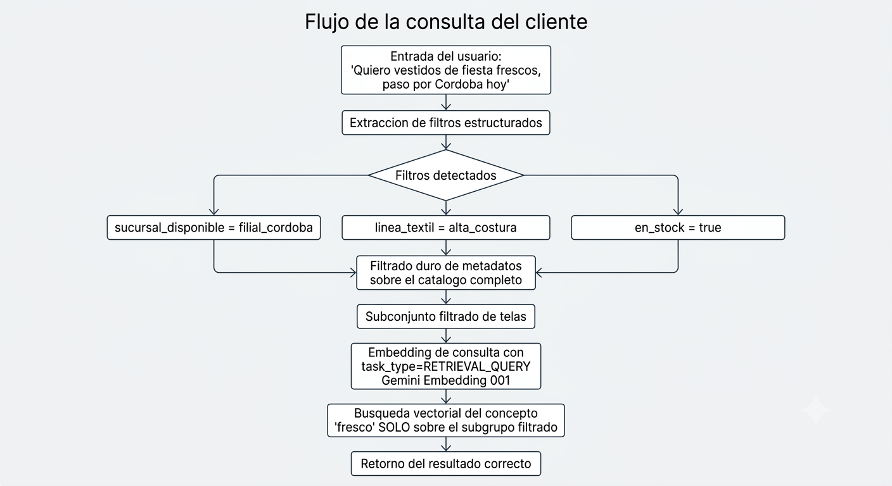

# Clase 4 — Eslabón del Proyecto: Búsqueda Semántica y el Catálogo de Telas


Esta versión reemplaza el proveedor de embeddings se recomienda el proveedor **Google GenAI** (`gemini-embedding-001`), usando el SDK moderno `google-genai`. Dos motivos concretos para el cambio, no solo preferencia:

1. `text-embedding-004` (el modelo legado de Google que aparece en tutoriales viejos) **se discontinúa el 14 de enero de 2026**. Cualquier proyecto nuevo debe arrancar directo con `gemini-embedding-001`.
2. `gemini-embedding-001` soporta **Matryoshka Representation Learning (MRL)**: podés pedir vectores de 3072, 1536 o 768 dimensiones desde la misma llamada, sin reentrenar nada. Esto te da control de costo/almacenamiento que `text-embedding-3-small` de OpenAI no ofrece de la misma forma nativa.

También cambia un concepto importante: Google GenAI tiene el parámetro `task_type`, que le dice al modelo *para qué* vas a usar ese embedding (no es lo mismo embeber un documento para indexarlo que embeber una consulta para buscar). 

Caso de uso:

- `RETRIEVAL_DOCUMENT` para el catálogo
- `RETRIEVAL_QUERY` para las consultas del cliente

---

## Objetivo de este entregable

Vas a producir cinco artefactos:

1. `catalogo_telas.py` — el catálogo de 15 fichas técnicas en memoria.
2. `similitud_coseno_manual.py` — la traducción a código del cálculo a mano del PDF, sin cambios (esto es matemática pura, no depende del proveedor de embeddings).
3. `pipeline_vectorial_ortelana.py` — el pipeline de FAISS con embeddings de Google GenAI, `task_type` correcto en cada etapa, y persistencia en disco.
4. `prueba_destructiva.py` — el experimento de "caída del servidor".
5. La carpeta de entrega asincrónica: `catalogo_ortelana.json` + `arquitectura_ortelana.md` con metadatos, Mermaid y las 3 Killer Queries.

---

## Setup del SDK

```bash
# recomendado el uso de uv
pip install google-genai faiss-cpu numpy python-dotenv
```

### Ejercicio para el alumno

Conseguí tu API key en Google AI Studio, guardala en `.env`, y confirmá con este script que carga antes de seguir.

---

## Parte 1 — El catálogo de telas en memoria

Sin cambios respecto al diseño original: esto es contenido de dominio, no código de proveedor.


`[catalogo_telas.py](src/catalogo_telas.py)`


### Ejercicio para el alumno

Agregá una ficha técnica número 16 de tu invención (algo fuera de indumentaria: tapicería de autos, mochilas técnicas, uso médico textil). La vas a usar más adelante para probar el límite del catálogo.

---

## Parte 2 — Desmitificando la caja negra: similitud coseno a mano

Sin cambios: es matemática pura, independiente del proveedor.

`[similitud_coseno_manual.py](src/similitud_coseno_manual.py)`


### Ejercicio para el alumno

1. Ejecutá el script y confirmá que el `assert` no falla.
2. Agregá `VECTOR_GABARDINA = [3, 3]` y comparalo contra `VECTOR_CONSULTA`. Explicá en una frase por qué el resultado tiene sentido.
3. Calculá la distancia euclidiana entre `[5,1]` y `[4,2]` y compará si cambia el ranking de "más parecido" respecto a la similitud coseno. Esto te prepara para entender por qué el script de la Parte 3 usa `IndexFlatL2` (distancia euclidiana) y no similitud coseno directamente — son métricas relacionadas pero no idénticas.

---

## Parte 3 — Pipeline con Google GenAI + FAISS + persistencia

> **Nota**:Diferencias con respecto al script del PDF (que usaba `client.embeddings.create(model="text-embedding-3-small", ...)` de OpenAI):

1. El cliente se instancia como `genai.Client()`, leyendo `GEMINI_API_KEY` del entorno automáticamente.
2. Cada llamada a `embed_content` lleva un `config=types.EmbedContentConfig(...)` con `task_type` distinto según si estás indexando el catálogo (`RETRIEVAL_DOCUMENT`) o resolviendo una consulta (`RETRIEVAL_QUERY`).
3. La dimensión por defecto de `gemini-embedding-001` es 3072, no 1536. Usamos `output_dimensionality=768` para mantener el índice liviano y la clase ágil — documentamos esa elección explícitamente.


`[pipeline_vectorial_ortelana.py](src/pipeline_vectorial_ortelana.py)`


### Ejercicio para el alumno

1. Ejecutá el pipeline por primera vez y confirmá que se crea `ortelana_telas.index`.
2. Volvé a ejecutarlo sin borrar el archivo. Confirmá que esta vez carga desde disco sin llamar a la API de embeddings para el catálogo.
3. **Experimento de `task_type`:** modificá temporalmente `obtener_embedding_consulta` para que use `task_type="RETRIEVAL_DOCUMENT"` en lugar de `RETRIEVAL_QUERY`, y volvé a correr una de las consultas de prueba. ¿Cambian las distancias L2 resultantes? Anotá tu observación: esto demuestra que `task_type` no es un parámetro cosmético, afecta el vector real que se genera.
4. Agregá tu propia consulta usando la ficha técnica 16 que inventaste en la Parte 1. Documentá si el sistema la encuentra correctamente.
5. Probá `output_dimensionality=3072` (el máximo) en una corrida aparte y compará el tamaño del archivo `.index` resultante contra la versión de 768 dimensiones con `os.path.getsize()`. Esto es evidencia concreta del trade-off de MRL que mencionamos en la introducción.

---

## Parte 4 — La prueba destructiva en caliente

Sin cambios de lógica: la persistencia en disco es independiente del proveedor de embeddings.

`[prueba_destructiva.py](src/prueba_destructiva.py)`

### Ejercicio para el alumno

1. Ejecutá el script y confirmá que el índice recuperado tiene el mismo número de vectores.
2. Si estás en Google Colab, hacé la prueba real: `Entorno de ejecución > Reiniciar entorno de ejecución`, y después corré solo el bloque que lee `faiss.read_index('ortelana_telas.index')`.
3. Con `output_dimensionality=768` en lugar de los 3072 nativos de `gemini-embedding-001`, calculá cuánto espacio en disco te ahorra el índice por cada 1000 telas indexadas (aproximación: cada float ocupa 4 bytes, así que la diferencia es `(3072 - 768) * 4 bytes * 1000`).

---

## Parte 5 — Consigna asincrónica: el catálogo con metadatos para la Clase 5

Sin cambios de estructura: el diseño de metadatos y filtrado híbrido es independiente del proveedor de embeddings, y es justamente lo que vas a resolver con ChromaDB en la Clase 5 (que también puede usar Google GenAI como función de embedding, algo que vas a configurar ahí).

### 5.1 — `catalogo_ortelana.json`

```json
[
  {
    "id": "TELA-001",
    "descripcion_semantica": "Tela pesada compuesta por 100% algodon, armada en sarga de alta resistencia. Ideal para pantalones de trabajo pesados, camperas de invierno rigidas y ropa de seguridad industrial.",
    "metadatos": {
      "linea_textil": "industrial",
      "sucursal_disponible": "central_buenos_aires",
      "en_stock": true,
      "tags": ["denim", "jean", "vaquero", "mezclilla", "ropa de trabajo"]
    }
  },
  {
    "id": "TELA-002",
    "descripcion_semantica": "Tul de red fina con bordado floral aplicado, usado exclusivamente en velos de novia, vestidos de quince anios y disenios de alta costura.",
    "metadatos": {
      "linea_textil": "alta_costura",
      "sucursal_disponible": "filial_cordoba",
      "en_stock": false,
      "tags": ["tul", "novia", "fiesta", "bordado", "quinceanios"]
    }
  }
]
```

### Ejercicio para el alumno

Completá el archivo con las 15 (o 16) fichas restantes, siguiendo la misma estructura: `id` alfanumérico único, `descripcion_semantica` rica en detalles, y `metadatos` con los cuatro campos obligatorios.

### 5.2 — `arquitectura_ortelana.md`: el flujograma Mermaid

```markdown
# Arquitectura de Filtrado Hibrido — Ortelana Textil

## Nota de stack
Embeddings generados con Google GenAI (gemini-embedding-001), no OpenAI.
Esto se mantiene consistente en la Clase 5 al configurar la funcion de
embedding personalizada de ChromaDB.

## Flujo de la consulta del cliente



### Ejercicio para el alumno

Adaptá el diagrama a tu propio ejemplo de consulta, usando una tela real de tu catálogo.

### 5.3 — Las 3 Killer Queries

```markdown
## Killer Queries

### Query 1 — Donde SQL falla (poder semantico y tags)
Consulta: "[tu consulta con jerga informal]"
Explicacion: ¿esto lo resuelve la cercania del vector, el array de tags,
o ambos?

### Query 2 — Donde el metadato salva el dia
Consulta: "[una consulta donde la busqueda semantica cruda traeria un
resultado desastroso sin el filtro duro]"
Explicacion: ¿que tela incorrecta recomendaria el sistema SIN el filtro
de metadatos?

### Query 3 — La prueba de estrés
Consulta: "[una consulta sumamente ambigua]"
Explicacion: ¿que hace tu sistema cuando no hay suficiente senial
semantica ni metadatos claros?
```

### Ejercicio para el alumno

1. Completá las 3 Killer Queries con ejemplos reales de tu catálogo.
2. Para la Query 2: ejecutá la búsqueda semántica cruda sin filtro usando `pipeline_vectorial_ortelana.py` y confirmá que efectivamente trae un resultado fuera de rubro.
3. Empaquetá `catalogo_ortelana.json` y `arquitectura_ortelana.md` juntos.

---

## Resumen del cambio de stack (para tu documento de arquitectura del TP1)

Agregá esta fila a la tabla de "Selección Justificada de Stack" que armaste en la Clase 3:

```markdown
| Capa | Tecnologia elegida | Alternativa descartada | Razon |
|---|---|---|---|
| Embeddings (Clase 4) | Google GenAI (gemini-embedding-001) | OpenAI text-embedding-3-small | Soporte nativo de MRL para controlar dimension/costo, task_type para optimizar segun uso (documento vs consulta), y consistencia con el resto del stack del proyecto |
```

## Cierre y enlace con la Clase 5

Documentaste en la Query 2 un caso donde FAISS plano recomienda una tela fuera de rubro. En la Clase 5 vas a migrar ese mismo catálogo a ChromaDB, configurando una función de embedding personalizada que llame a `gemini-embedding-001` en lugar del modelo local de `sentence-transformers` que aparece en el `05_clase.md` original — manteniendo la decisión de proveedor que tomaste hoy de forma consistente en todo el pipeline RAG.
