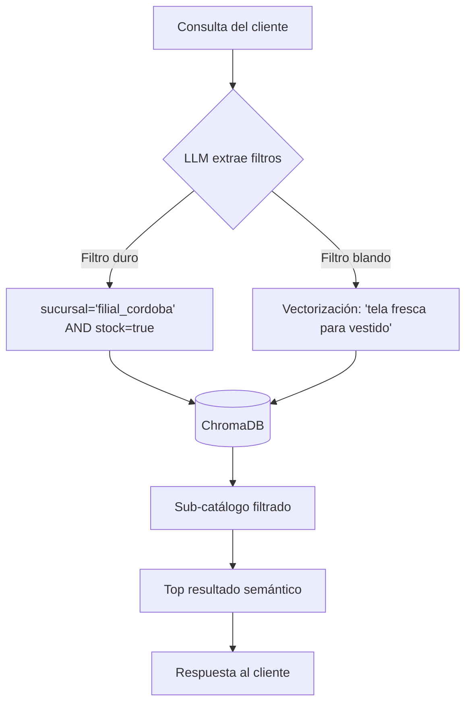

# Clase 4: Embeddings y Búsqueda Semántica — Del Catálogo Estático al Índice Vectorial

**Asignatura:** Desarrollo de Sistemas de Inteligencia Artificial

**Objetivo Técnico:** Comprender qué son los embeddings y la matemática de la similitud coseno, e implementar un índice de búsqueda semántica con FAISS sobre el catálogo de telas de Ortelana Textil — resolviendo el colapso del contexto estático que dejamos planteado en Clase 3.

> [!NOTE] **Para quienes vienen de las Microcredenciales**
> En las microcredenciales escucharon mencionar embeddings y bases de datos vectoriales como parte del stack de RAG. En esta clase los implementamos desde cero: qué son matemáticamente, cómo se generan, y cómo FAISS los usa para buscar por significado en lugar de por palabra exacta.

---

## Planificación de la Clase

| Bloque | Contenido |
| --- | --- |
| **Bloque 1** | Autopsia del contexto estático — defensa de hipótesis |
| **Bloque 2** | Geometría del lenguaje — embeddings y similitud coseno |
| **Bloque 3** | Laboratorio: indexando el catálogo de Ortelana con FAISS |
| **Bloque 4** | Cierre arquitectónico — límites de FAISS y persistencia |
| **Cierre** | Resumen, tarea asincrónica y conexión con Clase 5 |

---

## Bloque 1: Autopsia del Contexto Estático

### Arranque con la tarea asincrónica

La clase arranca con los alumnos defendiendo sus conclusiones del experimento de Clase 3: metieron el catálogo de telas entero en el System Prompt e intentaron que el LLM respondiera consultas de stock en tiempo real.

**Preguntar al grupo:**

* ¿Cuántos tokens consumió el prompt con el catálogo completo?
* ¿El modelo respondió correctamente cuando el dato relevante estaba en el medio de la lista?
* ¿Qué pasa si el stock cambia mientras el usuario está en la sesión?

### Los tres problemas del contexto estático

Mapear en el pizarrón con los ejemplos que traigan los alumnos:

**Problema 1 — Desangre de Tokens**
El catálogo de Ortelana tiene 500 artículos. Cada consulta de un distribuidor consume todos esos tokens — aunque el cliente solo pregunte por denim. Si hay 1.000 consultas por día, el costo se multiplica por 1.000. Económicamente inviable.

**Problema 2 — Lost in the Middle**
Los modelos pierden atención cuando se los satura con texto masivo. Si el dato de stock del denim está en el artículo 347 de 500, el modelo suele ignorarlo o alucinar la disponibilidad. Esto rompe la confianza comercial del sistema.

**Problema 3 — Inconsistencia de Estado Concurrente**
El prompt queda congelado durante la sesión. Si otra terminal de la fábrica vende los últimos metros de una tela un minuto después, el LLM sigue afirmando que hay stock. El sistema miente con seguridad.

> [!IMPORTANT] **La solución que construimos hoy**
> En lugar de meter todo el catálogo en el prompt, construimos una **Memoria Vectorial Externa**. Transformamos cada descripción de tela en un vector matemático y los guardamos en un índice FAISS. Cuando llega una consulta, buscamos solo los artículos más relevantes y pasamos únicamente esos al LLM. Precisión máxima, costo mínimo.

> [!TIP] **Pregunta #1**
> ¿Por qué SQL tampoco resuelve esto? Si tenemos el catálogo en una base de datos relacional, ¿no podemos simplemente hacer un SELECT?
> **Análisis:** SQL busca por coincidencia exacta de palabras. Si un cliente dice "busco algo fresco para un vestido", el `WHERE descripcion LIKE '%fresco%'` no encuentra nada — ninguna tela tiene esa palabra. Los embeddings buscan por **significado**: "fresco", "liviano", "transpirable" y "veraniego" están cerca en el espacio vectorial aunque sean palabras distintas.

---

## Bloque 2: Geometría del Lenguaje

### ¿Qué es un Embedding?

Un **embedding** es la representación numérica de un texto en un espacio de múltiples dimensiones. El modelo convierte cualquier texto — una palabra, una oración, un párrafo — en una lista de números (un vector). Textos con significados similares producen vectores cercanos en ese espacio.

**Ejemplo conceptual con el catálogo de Ortelana:**

```
"Denim pesado, tacto rústico, alta resistencia"  → [0.8, 0.1, 0.9, 0.2, ...]
"Lona industrial impermeable, muy resistente"    → [0.7, 0.1, 0.9, 0.3, ...]  # cercano
"Seda natural satinada, caída fluida, liviana"   → [0.1, 0.9, 0.1, 0.8, ...]  # lejano

```

> [!TIP] **La analogía del mapa**
> Imaginá un mapa donde cada tela ocupa una posición geográfica según sus propiedades. El denim y la lona industrial están en el "barrio de los materiales resistentes". La seda y la gasa están en el "barrio de los materiales delicados". La búsqueda semántica es preguntar: "¿cuáles son los artículos más cercanos a esta coordenada?"

**Modelos de embeddings disponibles:**

| Proveedor | Modelo | Dimensiones | Uso típico |
| --- | --- | --- | --- |
| OpenAI | `text-embedding-3-small` | 1536 | Prototipado y producción |
| OpenAI | `text-embedding-3-large` | 3072 | Mayor precisión, más costo |
| Anthropic | Vía Voyage AI | 1024 | Integración con Claude |
| Google | `text-embedding-004` | 768 | Ecosistema Google |
| Local | `sentence-transformers` | Variable | Sin costo, sin internet |

---

### Similitud Coseno — La matemática en el pizarrón

Antes de tocar código, calculamos a mano para desmitificar la "caja negra".

**Imaginemos un espacio de dos dimensiones para el catálogo de Ortelana:**

* **Eje X:** Resistencia Industrial (0 = delicado → 10 = indestructible)
* **Eje Y:** Elasticidad / Suavidad (0 = rígido → 10 = ultra flexible)

**Definimos dos vectores:**

* **Vector A** — Lona de Alta Densidad: `A = [5, 1]` *(mucha resistencia, mínima elasticidad)*
* **Vector B** — Consulta del cliente: `"Busco lona rígida para toldos"` → `B = [4, 2]`

**Fórmula:**

```
Similitud Coseno = (A · B) / (||A|| × ||B||)

```

**Paso 1 — Producto escalar:**

```
(5 × 4) + (1 × 2) = 20 + 2 = 22

```

**Paso 2 — Magnitudes:**

```
||A|| = √(5² + 1²) = √26 ≈ 5.10
||B|| = √(4² + 2²) = √20 ≈ 4.47

```

**Paso 3 — División final:**

```
Similitud = 22 / (5.10 × 4.47) = 22 / 22.80 ≈ 0.965

```

Un resultado de **0.965** (muy cercano a 1) significa que la consulta del cliente y la Lona de Alta Densidad apuntan casi en la misma dirección en el espacio vectorial — el motor los emparejó correctamente **sin que el cliente conociera el nombre técnico del producto**.

**¿Por qué el ángulo y no la distancia?**
Porque nos importa la dirección (el significado), no la magnitud (el largo del texto). Un párrafo largo sobre denim y una sola oración sobre denim deben ser similares aunque sus vectores tengan magnitudes muy distintas.

El resultado va de **-1 a 1**:

* `1.0` → idénticos en significado
* `0.0` → sin relación
* `-1.0` → significados opuestos

---

### Validación en Colab — NumPy Express

Los alumnos abren un notebook en blanco y validan el resultado del pizarrón con código:

```python
import numpy as np

def similitud_coseno(vec_a, vec_b):
    dot_product = np.dot(vec_a, vec_b)
    norma_a = np.linalg.norm(vec_a)
    norma_b = np.linalg.norm(vec_b)
    return dot_product / (norma_a * norma_b)

# Los vectores del pizarrón
lona_alta_densidad = np.array([5, 1])
consulta_cliente   = np.array([4, 2])
seda_natural       = np.array([1, 8])  # Para comparar

print(f"Lona vs Consulta: {similitud_coseno(lona_alta_densidad, consulta_cliente):.3f}")  # ~0.965
print(f"Seda vs Consulta: {similitud_coseno(seda_natural, consulta_cliente):.3f}")        # mucho menor

```

> [!TIP] **Pregunta #2**
> ¿Qué pasa si la consulta del cliente fuera "tela suave para vestidos"? ¿La Lona o la Seda quedaría más cerca?
> **Análisis:** La Seda. Una consulta sobre suavidad tendría un vector más cercano a `[1, 8]` que a `[5, 1]`. El motor automáticamente recuperaría el artículo correcto sin que nadie programara esa regla.

---

## Bloque 3: Laboratorio — Indexando el Catálogo de Ortelana con FAISS

### ¿Qué es FAISS y por qué existe?

**FAISS** (Facebook AI Similarity Search) es una librería de Meta que permite buscar los vectores más similares a una consulta de forma eficiente, incluso con millones de vectores.

**El problema que resuelve:** si tenemos 500 telas convertidas a vectores de 1536 dimensiones, calcular la similitud coseno entre la consulta y cada una de ellas sería lento. FAISS organiza los vectores en estructuras especiales que permiten encontrar los más cercanos sin comparar con todos.

**La analogía del índice de un libro:**
Buscar sin índice = leer todas las páginas.
Buscar con índice = ir directo a la página correcta.
FAISS es el índice de los vectores.

---

### Tipos de índice en FAISS

**`IndexFlatL2` — Búsqueda exacta (fuerza bruta)**

* Compara con todos los vectores. Resultado exacto, sin aproximaciones.
* Complejidad O(N) — perfecto para catálogos pequeños (< 10.000 artículos).
* Úsalo para prototipado y aprendizaje. **Es el que usamos hoy.**

**`IndexFlatIP` — Búsqueda exacta por producto interno**

* Equivalente a similitud coseno si los vectores están normalizados.
* Más apropiado para embeddings de OpenAI.

**`IndexIVFFlat` — Búsqueda aproximada (para escala)**

* Agrupa vectores en clusters con K-Means. Busca solo en los clusters más cercanos.
* Para catálogos de millones de artículos. Requiere entrenamiento previo.

> [!NOTE] **¿Por qué IndexFlatL2 hoy y no IVF?**
> El catálogo de Ortelana tiene decenas de artículos — la fuerza bruta es instantánea. En Clase 5 vemos por qué FAISS solo no alcanza para producción y migramos a ChromaDB.

---

### El campo `descripcion_semantica` — diseño intencional

Antes de ver el código, un concepto arquitectónico importante. En el catálogo de Ortelana cada artículo tiene un campo específico llamado `descripcion_semantica`:

```json
{
  "id": "TELA-001",
  "descripcion_semantica": "Denim pesado de 12 oz, 100% algodón rígido con teñido índigo intenso. Presenta un tacto rústico, alta resistencia al roce y cuerpo firme. Ideal para camperas y pantalones de trabajo.",
  "metadatos": {
    "linea_textil": "indumentaria",
    "sucursal_disponible": "central_buenos_aires",
    "en_stock": true,
    "tags_regionales": ["jean", "vaquero", "mezclilla", "ropa de trabajo"]
  }
}

```

> [!TIP] **¿Por qué `descripcion_semantica` y no solo `nombre`?**
> Porque el embedding se genera sobre ese texto. Cuanto más rico y descriptivo sea — textura, usos, tacto, sinónimos — mejor va a capturar el significado. Un campo `nombre: "Denim 12oz"` solo tiene 2 palabras para vectorizar. La `descripcion_semantica` tiene 40 palabras ricas en contexto. La calidad del embedding depende directamente de la calidad del texto que lo genera.

---

### Script del Pipeline Vectorial (pipeline_vectorial.py)

```python
import os
import numpy as np
import faiss
from dotenv import load_dotenv
from openai import OpenAI

load_dotenv()
client = OpenAI(api_key=os.getenv("OPENAI_API_KEY"))

# ── Catálogo de Ortelana Textil ───────────────────────────────────────────────
catalogo_ortelana = [
    {
        "id": "TELA-001",
        "descripcion_semantica": "Denim pesado de 12 oz, 100% algodón rígido con teñido índigo intenso. Tacto rústico, alta resistencia al roce y cuerpo firme. Ideal para camperas y pantalones.",
        "metadatos": {"linea_textil": "indumentaria", "sucursal": "central_bsas", "en_stock": True}
    },
    {
        "id": "TELA-002",
        "descripcion_semantica": "Seda natural con acabado satinado, caída fluida y brillo sofisticado. Tejido muy liviano y fresco al tacto, diseñado para vestidos de gala.",
        "metadatos": {"linea_textil": "alta_costura", "sucursal": "filial_cordoba", "en_stock": True}
    },
    {
        "id": "TELA-003",
        "descripcion_semantica": "Lona cobertora industrial con recubrimiento de PVC impermeable. Entramado de poliéster de alta tenacidad, nula flexibilidad y máxima resistencia al agua.",
        "metadatos": {"linea_textil": "industrial", "sucursal": "central_bsas", "en_stock": False}
    },
    {
        "id": "TELA-004",
        "descripcion_semantica": "Gabardina elastizada de 8 oz. Mezcla de algodón y spandex que otorga comodidad sin perder estructura. Textura diagonal clásica, ideal para pantalones de vestir.",
        "metadatos": {"linea_textil": "indumentaria", "sucursal": "filial_cordoba", "en_stock": True}
    },
    {
        "id": "TELA-005",
        "descripcion_semantica": "Gasa de algodón translúcida y ultra respirable. Ideal para prendas de verano muy sueltas y superposiciones. Requiere lavado a mano.",
        "metadatos": {"linea_textil": "alta_costura", "sucursal": "central_bsas", "en_stock": False}
    },
    {
        "id": "TELA-006",
        "descripcion_semantica": "Chenille de tapicería aterciopelado. Tejido grueso con tratamiento antimanchas, diseñado para soportar el roce constante en muebles de interior.",
        "metadatos": {"linea_textil": "tapiceria", "sucursal": "filial_cordoba", "en_stock": True}
    },
]

# ── Función para generar embeddings ──────────────────────────────────────────
def obtener_embeddings(textos: list[str]) -> list[list[float]]:
    response = client.embeddings.create(
        model="text-embedding-3-small",
        input=textos
    )
    return [item.embedding for item in response.data]

# ── PASO 1: Construir o cargar el índice ─────────────────────────────────────
INDEX_FILE = "ortelana_catalogo.index"
textos = [item["descripcion_semantica"] for item in catalogo_ortelana]

if not os.path.exists(INDEX_FILE):
    print("Generando embeddings del catálogo (consume tokens)...")
    embeddings = obtener_embeddings(textos)
    matriz = np.array(embeddings).astype('float32')

    dimension = matriz.shape[1]  # 1536 para text-embedding-3-small
    index = faiss.IndexFlatL2(dimension)
    index.add(matriz)

    faiss.write_index(index, INDEX_FILE)
    print(f"Índice guardado en '{INDEX_FILE}' ({index.ntotal} artículos)")
else:
    print(f"Cargando índice desde '{INDEX_FILE}' (0 tokens consumidos)...")
    index = faiss.read_index(INDEX_FILE)

# ── PASO 2: Búsqueda semántica ────────────────────────────────────────────────
consulta = "Necesito una tela abrigada y gruesa para hacer camperas de invierno de alta gama"
print(f"\nConsulta: '{consulta}'")

vector_consulta = np.array(obtener_embeddings([consulta])).astype('float32')

K = 2
distancias, indices = index.search(vector_consulta, K)

print("\n--- MEJORES COINCIDENCIAS ---")
for i, (dist, idx) in enumerate(zip(distancias[0], indices[0])):
    articulo = catalogo_ortelana[idx]
    print(f"\n{i+1}. [{articulo['id']}] Distancia L2: {dist:.4f}")
    print(f"   {articulo['descripcion_semantica'][:80]}...")
    print(f"   Stock: {articulo['metadatos']['en_stock']} | Sucursal: {articulo['metadatos']['sucursal']}")

```

**Output esperado:**

```
Consulta: 'Necesito una tela abrigada y gruesa para hacer camperas de invierno de alta gama'

--- MEJORES COINCIDENCIAS ---
1. [TELA-001] Distancia L2: 0.3821
   Denim pesado de 12 oz, 100% algodón rígido con teñido índigo intenso...
   Stock: True | Sucursal: central_bsas

2. [TELA-004] Distancia L2: 0.6234
   Gabardina elastizada de 8 oz. Mezcla de algodón y spandex...
   Stock: True | Sucursal: filial_cordoba

```

> [!TIP] **Interpretando las distancias L2**
> En `IndexFlatL2`, **menor distancia = mayor similitud**. El resultado 1 tiene distancia 0.38 (muy cercano) y el resultado 2 tiene 0.62 (más alejado). Si el cliente hubiera buscado "seda para vestidos de gala", TELA-002 habría aparecido primera.

---

### Tests de validación — ejecutar con el grupo

```python
consultas_test = [
    "Busco algo fresco y liviano para vestidos de verano",        # Debería traer TELA-002 o TELA-005
    "Necesito material resistente al agua para cubrir camiones",  # Debería traer TELA-003
    "Quiero tapizar sillones de living, algo que no se manche",  # Debería traer TELA-006
    "jean azul clásico"                                           # Tags regionales — ¿encuentra TELA-001?
]

for consulta in consultas_test:
    vector = np.array(obtener_embeddings([consulta])).astype('float32')
    distancias, indices = index.search(vector, 1)
    resultado = catalogo_ortelana[indices[0][0]]
    print(f"\nConsulta: '{consulta}'")
    print(f"Resultado: [{resultado['id']}] dist={distancias[0][0]:.4f}")
    print(f"  {resultado['descripcion_semantica'][:60]}...")

```

> [!NOTE] **Discutir con el grupo la última consulta**
> "jean azul clásico" usa jerga informal. ¿El sistema lo resuelve por el vector de la `descripcion_semantica` o necesitaría los `tags_regionales`? ¿Qué pasa si el resultado es TELA-003 (lona industrial) en lugar de TELA-001 (denim)? Eso es exactamente el problema que resuelve el filtrado híbrido de Clase 5.

---

## Bloque 4: Cierre Arquitectónico — Límites de FAISS

### Prueba destructiva — volatilidad de la RAM

Antes del cierre conceptual, una demostración en vivo:

1. Construir el índice **sin** `faiss.write_index()`.
2. Reiniciar el entorno de Colab (Runtime → Restart).
3. Intentar usar el índice → **todo perdido**, hay que regenerar (y pagar tokens de nuevo).

Ahora hacer lo mismo **con** `faiss.write_index()` → el índice se recarga desde disco sin consumir tokens.

> [!TIP] **Reflexión**
> ¿Qué pasa en producción si el servidor se reinicia? ¿El archivo `.index` local sobrevive? ¿Y si hay dos servidores? Eso nos lleva exactamente a por qué necesitamos algo más robusto que un archivo en disco.

---

### Los tres límites de FAISS en producción

**Límite 1 — Sin persistencia transaccional**
FAISS guarda en un archivo binario. Si el servidor se cae a mitad de una escritura, el archivo puede corromperse. No hay rollback, no hay transacciones.

**Límite 2 — Sin filtrado híbrido nativo**
FAISS solo busca por similitud vectorial. No puede hacer: *"buscá telas similares a 'abrigada' PERO solo las que tienen `en_stock = true` Y `sucursal = filial_cordoba`"*. Habría que filtrar el resultado después, lo cual es ineficiente.

**Límite 3 — Sin accesos concurrentes**
Si dos procesos intentan escribir en el índice al mismo tiempo, el archivo se corrompe. FAISS no gestiona concurrencia.

> [!IMPORTANT] **El gancho para Clase 5**
> Estos tres límites son exactamente lo que ChromaDB resuelve. En Clase 5 migramos el catálogo de Ortelana a ChromaDB: persistencia real, filtros combinados (semántica + metadatos) y gestión concurrente. La arquitectura del catálogo que construimos hoy es la base — solo cambia el motor de almacenamiento.

---

## Cierre y Material Asincrónico

### Resumen de la clase

* **Embedding:** representación vectorial de un texto. Textos similares → vectores cercanos.
* **Similitud coseno:** mide el ángulo entre vectores (no la distancia). Resultado entre -1 y 1.
* **`descripcion_semantica`:** campo diseñado intencionalmente para ser vectorizado — cuanto más rico, mejor el embedding.
* **FAISS:** organiza vectores para búsqueda eficiente. `IndexFlatL2` para catálogos pequeños, `IndexIVFFlat` para escala.
* **Persistencia:** `faiss.write_index()` / `faiss.read_index()` — evita regenerar embeddings cada vez.
* **Límites de FAISS:** sin persistencia transaccional, sin filtrado híbrido, sin concurrencia → ChromaDB en Clase 5.

---

### Material asincrónico — Entre Clase 4 y Clase 5

> [!IMPORTANT] **La Clase 5 arranca con este entregable — trabajar en equipo del TP1**

**Entregable: El catálogo enriquecido + arquitectura de filtrado**

**1. `catalogo_ortelana.json` — mínimo 15 telas**

Cada registro debe tener esta estructura exacta:

```json
{
  "id": "TELA-001",
  "descripcion_semantica": "Párrafo rico: textura, caída, usos, tacto, composición...",
  "metadatos": {
    "linea_textil": "indumentaria | alta_costura | tapiceria | industrial",
    "sucursal_disponible": "central_buenos_aires | filial_cordoba",
    "en_stock": true,
    "tags_regionales": ["término comercial", "sinónimo", "jerga local"]
  }
}

```

> [!NOTE] **Pro-tip de productividad**
> No pierdan tiempo tipeando. Pedirle a Claude o ChatGPT: *"Actuá como experto textil y generame un JSON de 15 telas con esta estructura exacta..."*. Lo que evaluamos es el **diseño de la estructura**, no el tipeo.

**2. Flujograma de arquitectura en Mermaid**

Diseñar el diagrama que muestra cómo viaja la consulta de un cliente. Debe incluir:

* Entrada del usuario (ej: "Quiero tela fresca para vestidos, paso por Córdoba hoy")
* Extracción de filtros estructurados (sucursal, línea, stock)
* Búsqueda vectorial sobre el subgrupo filtrado
* Retorno del resultado



**3. Las 3 "Killer Queries" — consultas trampa**

Para probar la robustez del diseño, definir 3 consultas que demuestren el valor de la arquitectura:

* **Query 1 (Poder semántico):** consulta con jerga informal muy arraigada. ¿La resuelve el vector o los `tags_regionales`?
* **Query 2 (El metadato salva el día):** consulta donde la búsqueda semántica cruda traería algo desastroso, pero el filtro de metadatos lo bloquea.
* **Query 3 (Prueba de estrés):** consulta sumamente ambigua que testea los límites del catálogo.

---

### Conexión con Clase 5

En la Clase 5 migramos el catálogo a **ChromaDB** — que agrega exactamente lo que le falta a FAISS: persistencia real en disco, filtrado híbrido (semántica + metadatos en una sola consulta) y gestión concurrente. El catálogo que construyen esta semana es la base de conocimiento que van a usar para el resto de la cursada.

---

## Bibliografía de la Clase

* **Alammar, J., & Grootendorst, M. (2024).** *Hands-On Large Language Models.* O'Reilly. Capítulo 5: "Text Embeddings and Vector Spaces".
* **Johnson, J., et al. (2019).** *Billion-scale similarity search with GPUs.* IEEE Transactions on Big Data. (El paper original de FAISS).
* **Documentación oficial FAISS** — [github.com/facebookresearch/faiss/wiki](https://www.google.com/search?q=https%3A%2F%2Fgithub.com%2Ffacebookresearch%2Ffaiss%2Fwiki)
* **OpenAI Embeddings Guide** — [platform.openai.com/docs/guides/embeddings](https://www.google.com/search?q=https%3A%2F%2Fplatform.openai.com%2Fdocs%2Fguides%2Fembeddings)