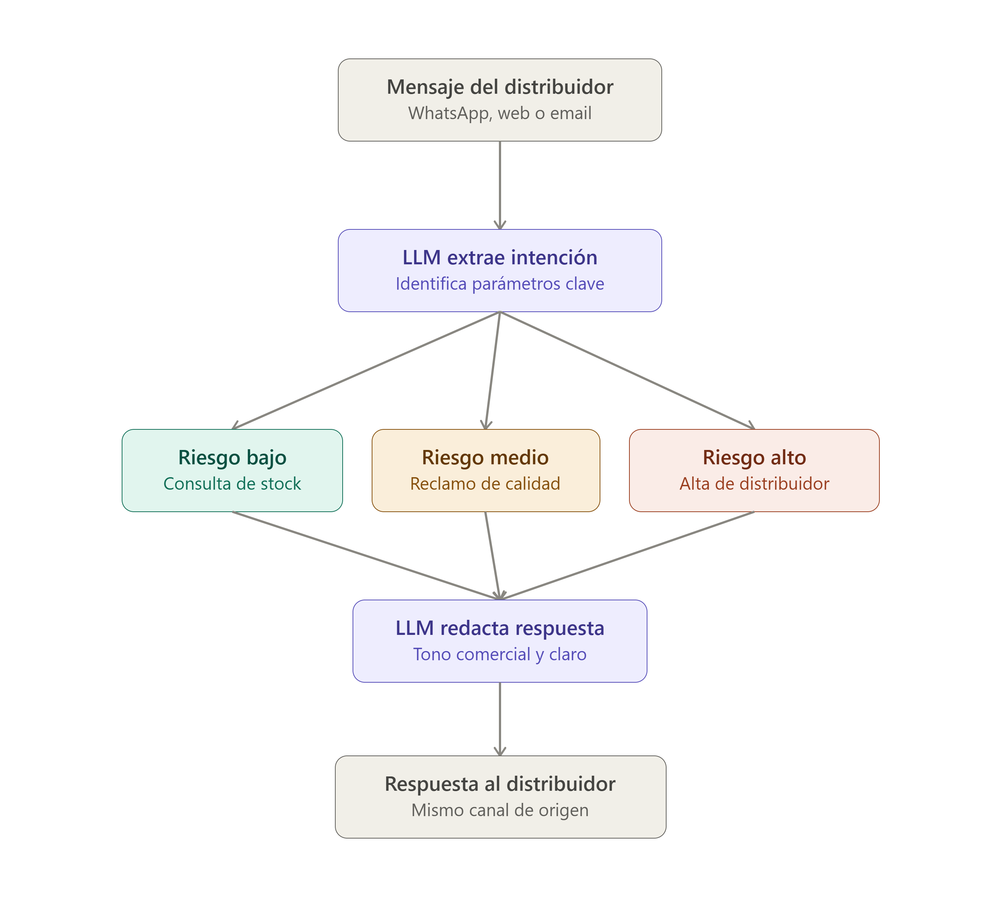

# Arquitectura de capas: la IA solo interpreta y redacta, el motor de reglas es quien decide.

Ahora el flujo de una interacción, ramificado por nivel de riesgo:

**PEAS del ecosistema**

| Pilar | Descripción |
|---|---|
| Performance | Alta aprobada en <10 min; consulta de stock <30 seg; falsos positivos en aprobación de crédito <2%; tasa de JSON inválido del LLM <1% |
| Environment | WhatsApp Business, formulario web, correo IMAP, ERP legado, API ARCA |
| Actuators | Alta/rechazo en ERP, apertura de ticket en CRM, respuesta redactada por canal original, notificación a equipo comercial |
| Sensors | Texto libre del mensaje, adjuntos (PDF fiscal, habilitación), metadata de canal y timestamp |
| Base de conocimiento | BD SQL (`distribuidores`, `interacciones`), normativa comercial interna, padrón fiscal vía API ARCA |

---

# PRD — Ecosistema de asistencia IA para Ortelana Textil

## 1. Objetivo
Reemplazar la atención manual de distribuidores (WhatsApp, web, email) por un sistema híbrido LLM + reglas deterministas, cubriendo tres subsistemas: onboarding, consulta de stock y reclamos de calidad.

## 2. Problema
- Volumen: ~50 correos/día procesados a mano.
- Latencia: solicitudes de viernes se responden el martes, con pérdida de ventas.
- Complejidad: aprobación de cuenta corriente cruza categoría fiscal, historial de pagos y normativa interna.

## 3. Alcance
| Subsistema | Incluido |
|---|---|
| Onboarding de distribuidores | Sí — alta, validación CUIT, aprobación/rechazo |
| Consulta de stock | Sí — disponibilidad en lenguaje natural |
| Gestión de reclamos | Sí — clasificación y apertura de ticket |
| Negociación de precios o descuentos | No |
| Reemplazo del ERP legado | No |

## 4. Usuarios
Distribuidores textiles (mayoristas y talleres) que contactan por canal informal, y el equipo comercial que hoy resuelve manualmente.

## 5. Arquitectura (ver diagramas)
`Canal → LLM extractor (intención + parámetros) → Motor de reglas determinista → Datos y APIs (SQL, ARCA, ERP/CRM) → LLM redactor → respuesta por el mismo canal.`
El LLM nunca decide; solo interpreta entrada y redacta salida. Toda decisión de negocio pasa por código o SQL.

## 6. Matriz de intenciones (resumen)
| Intención | Riesgo | Acción backend |
|---|---|---|
| CONSULTA_STOCK | Bajo | SELECT en BD de inventario |
| RECLAMO_CALIDAD | Medio | Abre ticket en CRM |
| ALTA_DISTRIBUIDOR | Alto | Valida CUIT + API ARCA + score crediticio |

## 7. Requisitos no funcionales
- Validación de todo output del LLM contra esquema (Pydantic) antes de tocar el backend.
- Ninguna decisión de crédito o aprobación se toma sin consulta a BD/API real.
- Auditoría: cada interacción queda registrada (`interacciones`: texto, intención, respuesta, timestamp).
- Resistencia a prompt injection: instrucciones del usuario nunca sobrescriben el system prompt.

## 8. Métricas de éxito
- Tiempo de respuesta de onboarding: de 3 días a <10 min.
- Tasa de falsos positivos en aprobación: <2%.
- % de mensajes clasificados correctamente por intención: >95%.

## 9. Fuera de alcance (v1)
Memoria conversacional multi-turno, RAG sobre normativa interna, soporte de voz.

## 10. Hipótesis más riesgosa
Se asume que el distribuidor incluye su CUIT en el primer mensaje. Si no lo hace, el sistema necesita memoria de conversación para pedirlo (fuera de alcance v1).